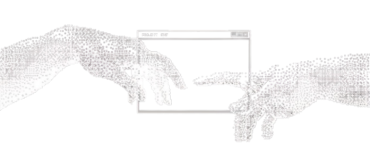

  

<!--  -->

 

<h1 align="center">Well hello there</h1>

<h3 align="center">Tryna be Indie Hacker</h3>

  

##  <h2 align="center">About Me </h2>

**Sid**, Here  a hacker and tinkerer, with interests in scaling to the moon.

I enjoy dribbling around with new tech I can get my hands on and buliding, scaling then breaking on prod.

I am in need, the need for on call and prod breaks at 3am.
 

 <h2 align="center">Connect</h2>

  
  &nbsp;&nbsp;&nbsp;
  
  &nbsp;&nbsp;&nbsp;
  

<h2 align="center">Tech Stack</h2>

  

  

## 🎧 Spotify Playing

 

## Holopin Badges:

 

## My Github Stats: 

  
  
  

<h2 align="center">⌘ Commit Activity</h2>

<picture>
  <source media="(prefers-color-scheme: dark)"
    srcset="https://raw.githubusercontent.com/Sid-Lais/Sid-Lais/output/pacman-contribution-graph-dark.svg">

  <source media="(prefers-color-scheme: light)"
    srcset="https://raw.githubusercontent.com/Sid-Lais/Sid-Lais/output/pacman-contribution-graph.svg">

  

